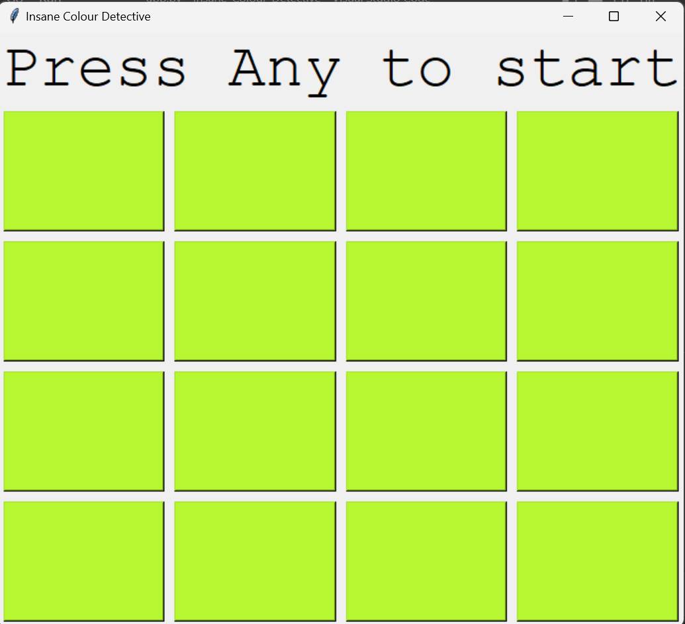
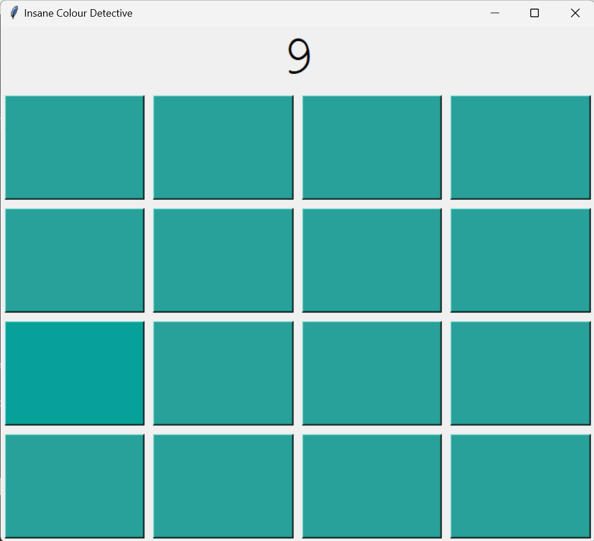

# Insane-Colour-Detective

## Description
A simple game in which the player needs to spot the cell with a different color.

## Project Demo
The project is still being worked on to put it into a website. For now, you can download it and run it on your console.

## Screenshots

## Technologies Used
- tkinter
- flask

## Acknowledgement
The creation of widgets and GUI was based on the following page:
[Create First GUI Application using Python Tkinter](https://www.geeksforgeeks.org/create-first-gui-application-using-python-tkinter/)

The conversion of an RGB color tuple to a hexadecimal string was based on the following post:
[Converting an RGB Color Tuple to a Hexadecimal String](https://stackoverflow.com/questions/3380726/converting-an-rgb-color-tuple-to-a-hexidecimal-string)
